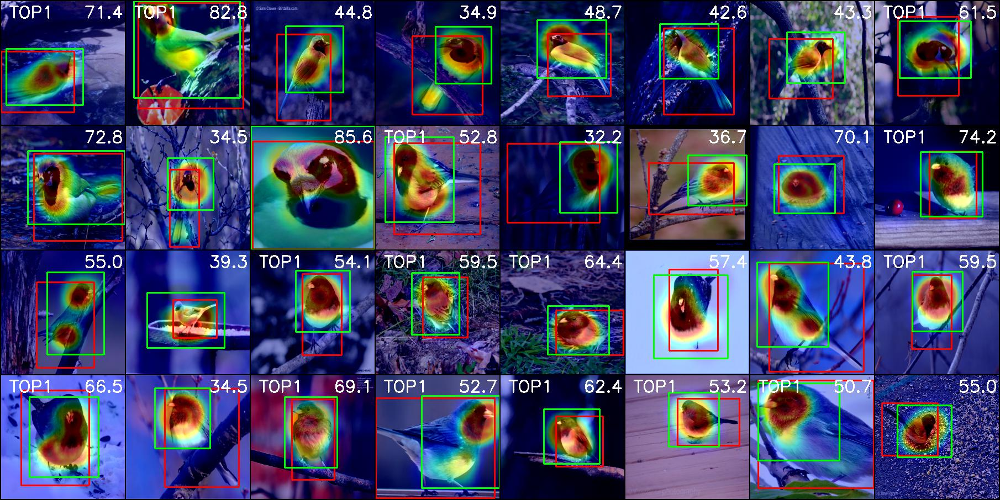

# [Adversarial Complementary Learning for Weakly Supervised Object Localization](http://openaccess.thecvf.com/content_cvpr_2018/papers/Zhang_Adversarial_Complementary_Learning_CVPR_2018_paper.pdf)

This is PyTorch implementation of [Adversarial Complementary Learning for Weakly Supervised Object Localization](http://openaccess.thecvf.com/content_cvpr_2018/papers/Zhang_Adversarial_Complementary_Learning_CVPR_2018_paper.pdf)


## Prerequisites

- Python 3.6+
- Pytorch ( >= 1.1)
- Python bindings for OpenCV
- tqdm
- tensorboardX

## Data Preparation

- [ImageNet download link](http://image-net.org/download)
- [CUB-200-2011 download link](http://www.vision.caltech.edu/visipedia/CUB-200-2011.html)


## Execution
##### Train

```
git clone https://github.com/halbielee/ACoL_pytorch.git
wget http://www.vision.caltech.edu/visipedia-data/CUB-200-2011/CUB_200_2011.tgz
tar -xvf CUB_200_2011.tgz
cd ACoL_pytorch
bash script/train.sh
```

##### Evaluate

```
# First download trained model from the link
bash script/evaluate.sh
```


## Performance
 We provide the performance with trained model.  

| Dataset  | Method     | Acc1 | Acc5 | Top1_LOC(0.15/0.2) | GT-known | condition |
| -------- | -------- | ---- | ---- | -------- | ------- | -------------------- |
| CUB-200  | [acol]([https://drive.google.com/a/yonsei.ac.kr/file/d/1wK9k2HBZMk_W4ZukS0MSfA7i23ewaLUE/view?usp=sharing](https://drive.google.com/file/d/1lAgQRbuVo0xN_3wQ-SwD-bqFTv4arqxS/view?usp=sharing)) | 76.46 | 92.44 | 49.78 / 46.06   | 59.46   | batch 32, lr 0.001, wd 1e-4, 40/150, thr 0.7 |


## Qualitative Image


